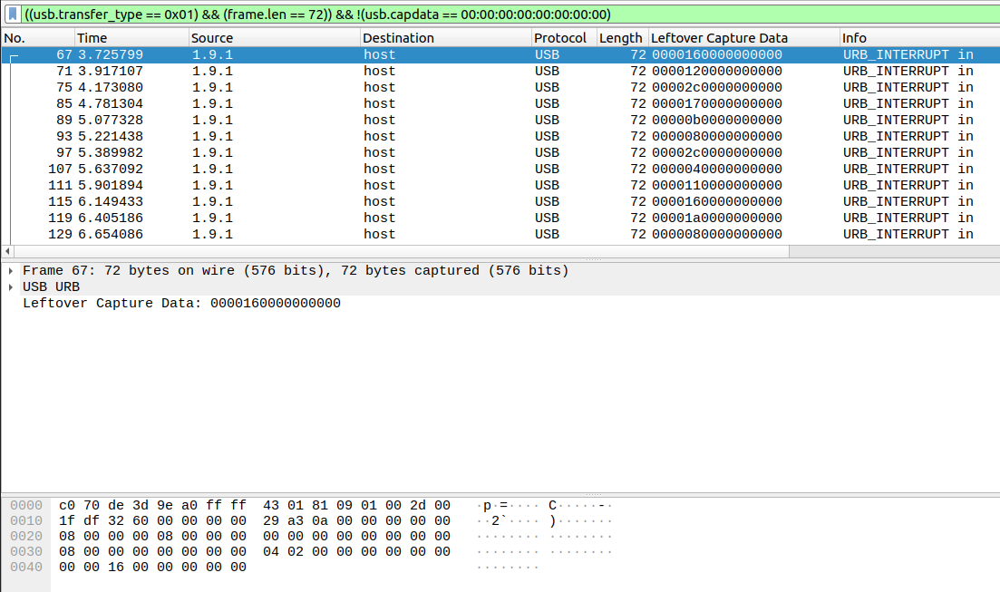

# Henpeck

Tags: _Wireshark_

## Challenge

>Author: @JohnHammond#6971
>
>So I'll be honest, I never actually went through the Mavis Beacon program...
>
>Download the file below.
>
>Attachments:  henpeck.pcap

## Wireshark

`((usb.transfer_type == 0x01) && (frame.len == 72)) && !(usb.capdata == 00:00:00:00:00:00:00:00)`



Export as CSV  (leftdata.csv)

`File > Export Packet Dissections > as CSV...`

## Filtering

### CUT method

cat leftdata | cut -d “,” -f 7 | cut -d “\”” -f 2 | grep -vE “Leftover Capture Data” > hex.txt

### AWK method

cat leftdata.csv |awk -F "," '{print$7}'|awk -F "\"" '{print$2}' |grep -vE "Leftover Capture Data" > hex.txt

## Solving


```
$ python2 solve.py
sotheanswerisflag[f7733e0093b7d281dd0a30fcf34a9634]hahahahlolc
```

`flag{f7733e0093b7d281dd0a30fcf34a9634}`
