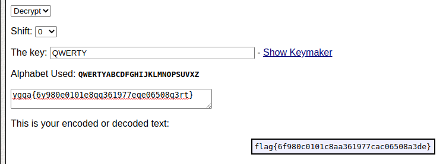

# Car Keys

Tags: _cipher_ _keyed caesar cipher_

## Challenge
>Author: @JohnHammond#6971
>
>We found this note on someone's key chain! It reads... ygqa{6y980e0101e8qq361977eqe06508q3rt}? There was another key that was engraved with the word QWERTY, too...

## Solving
http://rumkin.com/tools/cipher/caesar-keyed.php

`flag{6f980c0101c8aa361977cac06508a3de}`
