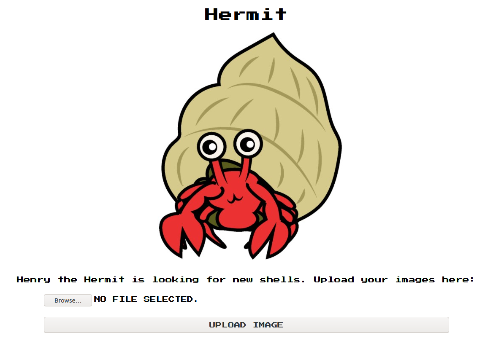
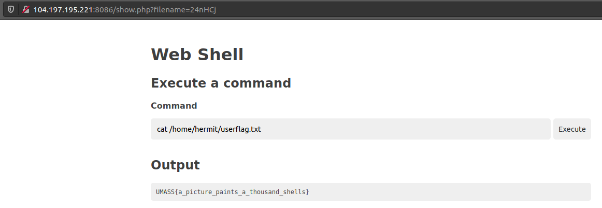

# Hermit - Part 1

>Help henry find a new shell
>
>http://104.197.195.221:8086 
>http://34.121.84.161:8086
>
>Created by Cobchise#6969

>## Hint
>How do you know a file is an image?

## Uploading a web shell

## cat flag

`UMASS{a_picture_paints_a_thousand_shells}`
